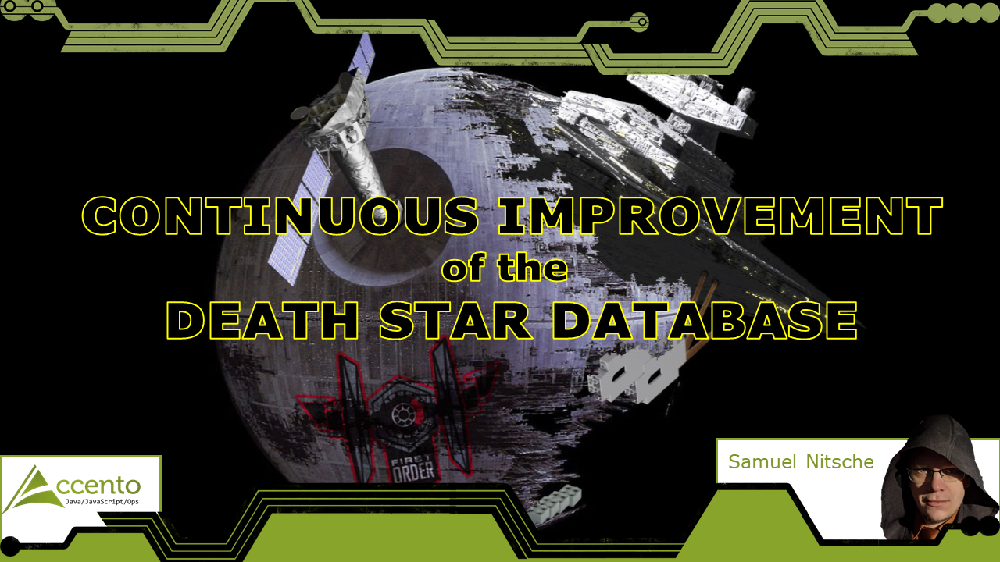

# Continuous Improvement of the Death Star
  

Example Repo for my talk about modern development techniques used in a relational database.

## Slides

for the different events where I did this talk can be found in [slides/](slides/)

## Talk Abstract

“Database development is outdated, inflexible and boring” - this opinion is not only held by the Sith Lord in charge of the Deathstar development. On the other hand, the amount of data we have to deal with has increased enormously and modern SQL is constantly among the top requested development skills.
Terms like “Big data” and “data science” are thrown around, but the data we talk about is often processed outside of the systems in which it is stored.

One reason might be that database development as a whole is considered to be stagnant, stiff and far from modern agile development methodologies.

These prejudices, held by his supervising Sith Lord, are becoming a challenge for the imperial developer tasked with modernizing the management software of the imperial army.

During this talk, the developer not only has to convince his Sith Lord that there are good reasons to process data where it is already stored but also needs to find solutions for improving and changing the database reliably, flexibly and continuously.
Necessary preconditions for agile development like version control, isolated development environment and unit-testing in the database are covered, as are special challenges like continuous updates via migrations and concepts of Evolutionary Database Design.
All topics are demonstrated in a specific, Star Wars themed example project.

## Content

The talk consists mainly of two parts:

### The pragmatic starter kit for databases

- Version Control
- Regression Testing
  - Database Specialty: Creating a Sandbox
- Full Automation
  - Database Specialty: Reliable transport of changes

### Evolutionary Database Design

Example of refactoring and changing a database model with many very small steps without breaking dependent apps.

# Resources
[Evolutionary Database Design](https://www.martinfowler.com/articles/evodb.html) by Martin Fowler  
[One does not simply update a database](https://cleandatabase.wordpress.com/2017/11/28/one-does-not-simply-update-a-database-migration-based-database-development/)  
[There is no (clean) database without version control](https://cleandatabase.wordpress.com/2017/09/22/there-is-no-clean-database-development-without-version-control/)  
[Book: Accelerate](https://www.amazon.com/Accelerate-Software-Performing-Technology-Organizations/dp/1942788339) by Nicole Forsgren, Jez Humble, Gene Kim  
[Book: The Pragmatic Programmer](https://www.amazon.com/Pragmatic-Programmer-journey-mastery-Anniversary/dp/0135957052) by Dave Thomas, Andrew Hunt  
[Book: Refactoring Databases](https://www.amazon.com/Refactoring-Databases-Evolutionary-Addison-Wesley-Signature-ebook/dp/B001QAP36E) by Scott Ambler, Pramod Sadalage  

## Tools

[utPLSQL](http://utplsql.org)  
[tSQLt](https://tsqlt.org/)  
[flyway](https://flywaydb.org/)  
[LiquiBase](https://www.liquibase.org/)  